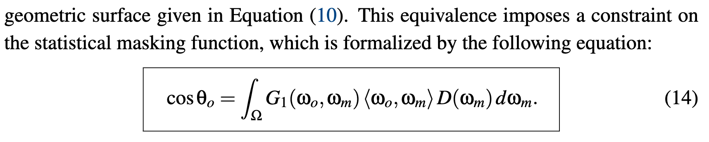
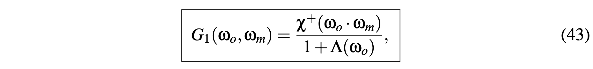
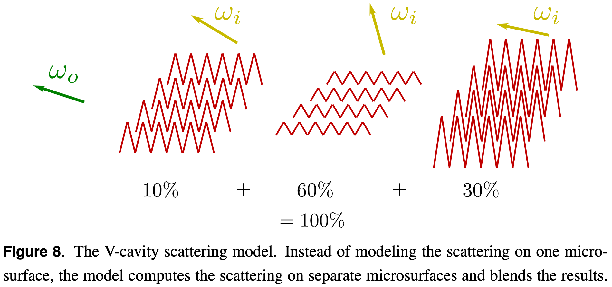
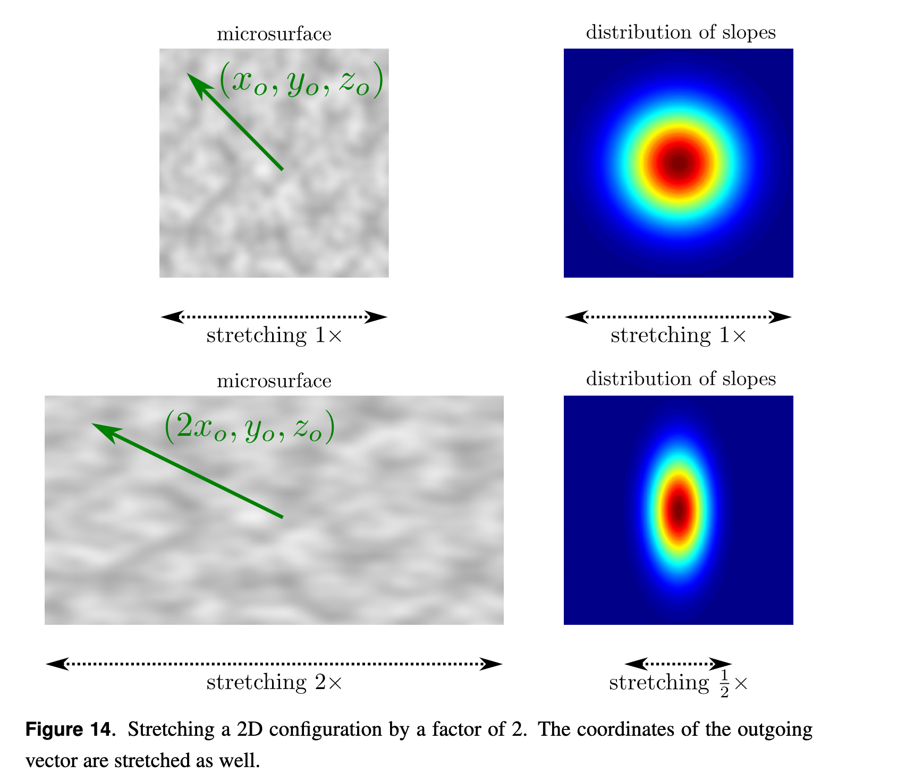

# Deep in Microfacet BRDF

  - [Reference](#reference)
  - [Some Microfacet Theory](#some-microfacet-theory)
    - [Measuring Radiance on a Surface](#measuring-radiance-on-a-surface)
    - [Microfacet Statistics](#microfacet-statistics)
      - [The Distribution of Normals](#the-distribution-of-normals)
    - [Microfacet Projections](#microfacet-projections)
    - [A Constraint on the Masking Function](#a-constraint-on-the-masking-function)
  - [Microfacet-Based BRDFs](#microfacet-based-brdfs)
    - [Distribution of Visible Normals](#distribution-of-visible-normals)
    - [Construction of the BRDF](#construction-of-the-brdf)
    - [Construction of The BRDF with Specular Microfacets](#construction-of-the-brdf-with-specular-microfacets)
    - [Construction of The BRDF with Diffuse Microfacets](#construction-of-the-brdf-with-diffuse-microfacets)
    - [The BRDF Normalization Test](#the-brdf-normalization-test)
      - [The White Furnace Test](#the-white-furnace-test)
    - [Good Summary](#good-summary)
  - [Normal Distribution Functions](#normal-distribution-functions)
    - [How is the NDF really defined](#how-is-the-ndf-really-defined)
    - [Isotropic NDF](#isotropic-ndf)
  - [Masking Functions](#masking-functions)
    - [The Smith Microsurface Profile](#the-smith-microsurface-profile)
      - [normal/masking independence](#normalmasking-independence)
      - [derive the Smith masking function](#derive-the-smith-masking-function)
      - [properties](#properties)
    - [The V-Cavity Microsurface Profile](#the-v-cavity-microsurface-profile)
      - [major principle](#major-principle)
      - [NDF](#ndf)
      - [masking function](#masking-function)
      - [properties](#properties-1)
    - [Non-Physically Based Masking Functions](#non-physically-based-masking-functions)
      - [what is "physically based"](#what-is-physically-based)
      - [The Implicit Masking Function](#the-implicit-masking-function)
      - [The Schlick-Smith Masking Function](#the-schlick-smith-masking-function)
      - [The Kelemen Masking Function](#the-kelemen-masking-function)
    - [Summary](#summary)
  - [Stretch Invariance of the Masking Function](#stretch-invariance-of-the-masking-function)
    - [Masking Probability Invariance](#masking-probability-invariance)
    - [The Distribution of Slopes](#the-distribution-of-slopes)
    - [Isotropic Shape-Invariant Distributions of Slopes](#isotropic-shape-invariant-distributions-of-slopes)
      - [Shape Invariance](#shape-invariance)
      - [Beckmann Distribution](#beckmann-distribution)
      - [GGX Distribution](#ggx-distribution)
      - [Shape-Variant Distributions](#shape-variant-distributions)
    - [Anisotropic Shape-Invariant Distributions of Slopes](#anisotropic-shape-invariant-distributions-of-slopes)
      - [Shape Invariance](#shape-invariance-1)
      - [Derivation of the Masking Function](#derivation-of-the-masking-function)
      - [Anisotropic Beckmann Distribution](#anisotropic-beckmann-distribution)
      - [Anisotropic GGX Distribution](#anisotropic-ggx-distribution)
    - [More Generalization](#more-generalization)
      - [Arbitrary Shape-Invariant Distributions](#arbitrary-shape-invariant-distributions)
      - [Non Axis-Aligned Stretching](#non-axis-aligned-stretching)
      - [Vertical Shearing and Non-Centered Distributions](#vertical-shearing-and-non-centered-distributions)
  - [The Smith Joint Masking-Shadowing Function](#the-smith-joint-masking-shadowing-function)
    - [Separable Masking and Shadowing](#separable-masking-and-shadowing)
    - [Height-Correlated Masking and Shadowing](#height-correlated-masking-and-shadowing)
    - [Direction-Correlated Masking and Shadowing](#direction-correlated-masking-and-shadowing)
    - [Height-Direction-Correlated Masking and Shadowing](#height-direction-correlated-masking-and-shadowing)

## Reference
- Microfacet Models for Refraction through Rough Surfaces, 2007
- Eric Heitz, Understanding the Masking-Shadowing Function in Microfacet-Based BRDFs, 2014
  这篇paper真的不错，把BRDF, NDF, shadowing-masking的原理和关系讲的很清楚。

## Some Microfacet Theory
### Measuring Radiance on a Surface

### Microfacet Statistics
Microfacet theory is a statistical model of the scattering properties of the micro-surface.

#### The Distribution of Normals

D is actually the distribution of normals **per square meter of the geometric surface** and this is why it is measured in m2/sr and not in 1/sr

### Microfacet Projections

### A Constraint on the Masking Function
- constraint 1 : projection area
 
- constraint 2 : microsurface profile
  - the distribution of normals is like a histogram, describing only the proportion of each normal on the microsurface.
  - microsurface provide information of how microsurfaces are organized
  即给定microsurface profile, 就可以推出masking function

## Microfacet-Based BRDFs
### Distribution of Visible Normals

注意， D的单位是m^2/sr, D_wo的单位是1/sr, 归一化指的是投影面积上的归一化

### Construction of the BRDF
- micro-BRDF

- macro-BRDF
 
- introducing masking-shadowing function
  
   - w_g dot w_o 是normalize the integral by the projected area of the geometric surface on outgoing direction引入的
   - w_g dot w_i 是入射光在投影面积上的分量引入的

### Construction of The BRDF with Specular Microfacets

- jacobian 项怎么来的
  是把outgoing方向的变量替换成half vector变量产生的jacobian项
  
  
  
  
  
  hr 替换成  i+o 就能得到上面的式子

### Construction of The BRDF with Diffuse Microfacets

### The BRDF Normalization Test
#### The White Furnace Test 
- BSDF
  BRDF+BTDF
  
- White Furnace Test
   assume no absorption, no transmitted rays and all rays are reflected without energy loss
  
  https://github.com/knarkowicz/FurnaceTest  白炉测试的实现
- The Weak White Furnace Test
   without Fresnel and shadowing
  

### Good Summary

## Normal Distribution Functions
### How is the NDF really defined
https://www.reedbeta.com/blog/hows-the-ndf-really-defined/

the density of micro-area over the joint domain of **macro-area and solid angle**

  
### Isotropic NDF
https://zhuanlan.zhihu.com/p/69380665

## Masking Functions

### The Smith Microsurface Profile
#### normal/masking independence
The Smith microsurface profile assumes that the microsurface is **not autocorrelated**.

#### derive the Smith masking function
把normal space 转换到slope space进行计算

#### properties
- uncorrelated assumption can cause artifacts

### The V-Cavity Microsurface Profile
####  major principle 

Each microsurface is composed of two normals ωm = (xm,ym,zm)
and ωm′ = (−xm,−ym,zm) and the contribution of each microsurface is weighted by <ωm,ωg>D(ωm) in the final BRDF.
#### NDF
考虑到归一化

#### masking function

- V-cavity masking function 

#### properties
- For a single microsurface, highly visible normals would
occupy more projected area than less visible normals and thus have a higher contribution. There is **no view dependence** in the weighting (except that backfacing normals are discarded). This is why the V-cavity model poorly incorporates the effect of visibility and ends up simulating something **close to a normal map**.

- no such effect of V-cavity model that BRDF distribution shifted toward the outgoing direction as roughness increase
 

### Non-Physically Based Masking Functions
#### what is "physically based"
- ensure conservation of the projected are
 
- satisfy the Weak White Furnace Test
 
 

#### The Implicit Masking Function

does not satisfy the conservation of the projected area

#### The Schlick-Smith Masking Function 

#### The Kelemen Masking Function

### Summary

The real reason to choose it is that Smith’s formula is the exact masking function under the assumption of the chosen microsurface profile (i.e. normal/masking independence).

## Stretch Invariance of the Masking Function
Investigate the **invariance property** of the masking function and of the distribution of slopes when the configuration is stretched.
### Masking Probability Invariance

After stretching, occluded rays are still occluded and unoccluded rays are still unoccluded --- the masking probability is invariant to configuration stretching when **all of the slopes** involved in the configuration are **scaled at the same time**.
### The Distribution of Slopes
- the distribution of heights of the microsurface is often denoted P1(h)
- distribution of slopes of the microsurface
   
   注： tan的倒数是1/ (cos^2)
### Isotropic Shape-Invariant Distributions of Slopes
#### Shape Invariance
-  changing roughness is equivalent to **stretching the distribution without changing its shape**
 
-  the masking function depends 
   
#### Beckmann Distribution

#### GGX Distribution

#### Shape-Variant Distributions
Phong distribution

### Anisotropic Shape-Invariant Distributions of Slopes
#### Shape Invariance

#### Derivation of the Masking Function

any configuration with an anisotropic shape-invariant distribution can be trans-
formed back to a configuration with an isotropic distribution

#### Anisotropic Beckmann Distribution

#### Anisotropic GGX Distribution

### More Generalization
#### Arbitrary Shape-Invariant Distributions
An important property of shape-invariant distributions is that all of the information required for the masking function is **contained in the same 1D function** Λ, for any roughness or anisotropy.

#### Non Axis-Aligned Stretching

#### Vertical Shearing and Non-Centered Distributions
The masking function is also invariant under vertical shearing, because the roughness
and the normalization factor are invariant under shearing—which alters all the slopes,
and hence the normal vectors—these might also be invariant under a rotation of the normals.

## The Smith Joint Masking-Shadowing Function

### Separable Masking and Shadowing

does not model correlations between masking and shadowing, and therefore
always overestimates shadowing since some correlation always exists

### Height-Correlated Masking and Shadowing 
the more a microfacet
is elevated within the microsurface, the more the probabilities of being visible for the
outgoing direction (unmasked) and for the incident direction (unshadowed) increase
at the same time.

This form is accurate when the outgoing and incident directions are far away from
each other, but overestimates shadowing when the directions are close.
- derivation
  
  suppose that there is no directional correlation for masking from directions ωo and ωi, then the probability that a point at height h is visible from both directions is just the product of the probabilities
 
 

### Direction-Correlated Masking and Shadowing
Masking and shadowing are also strongly correlated when the outgoing and incident directions are close to one another.

### Height-Direction-Correlated Masking and Shadowing

