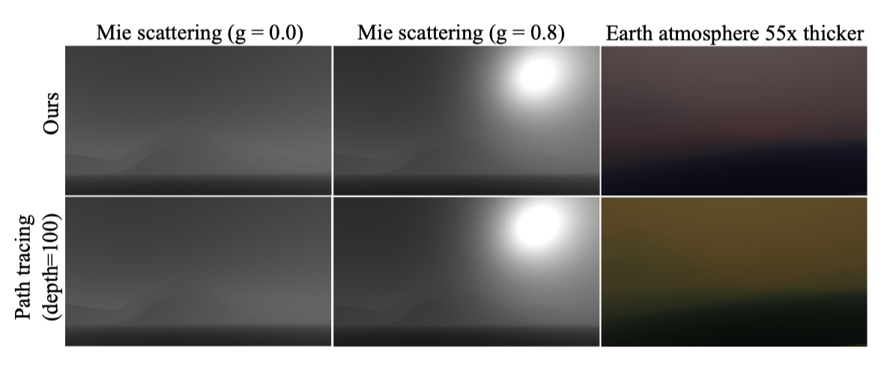
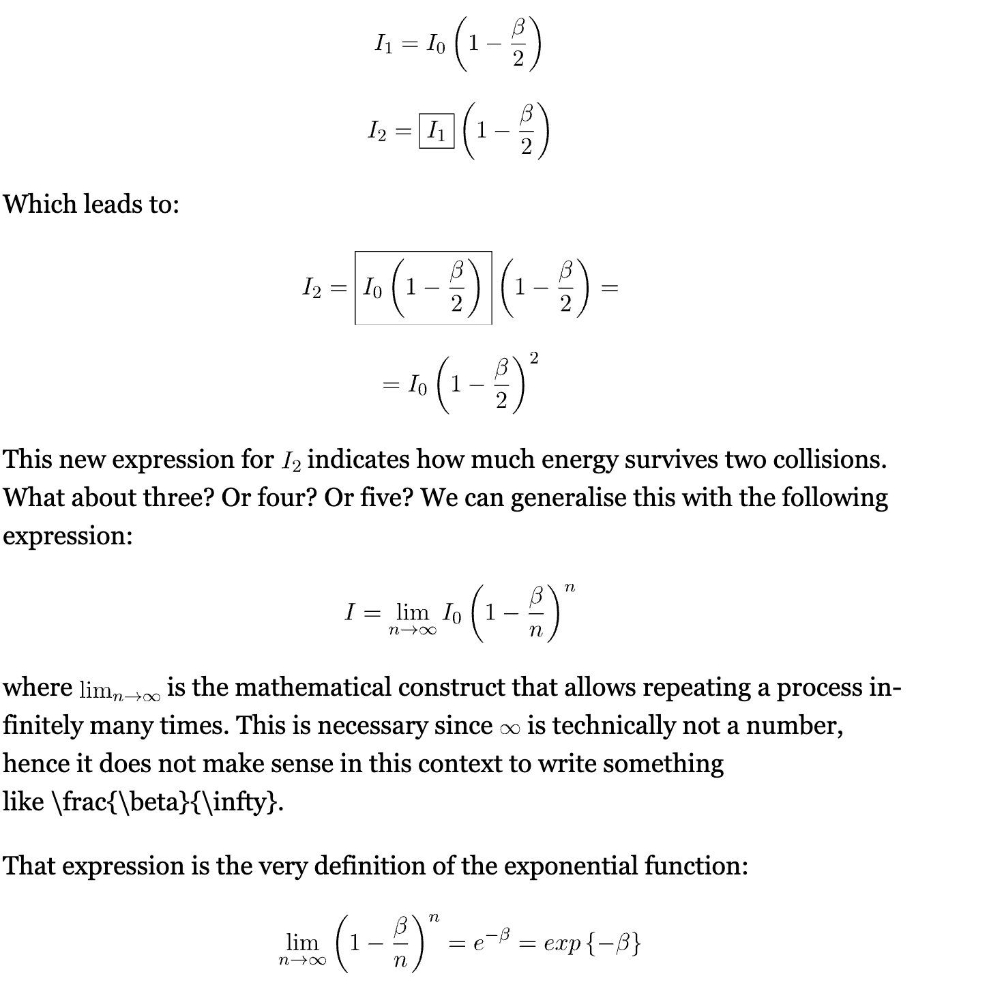
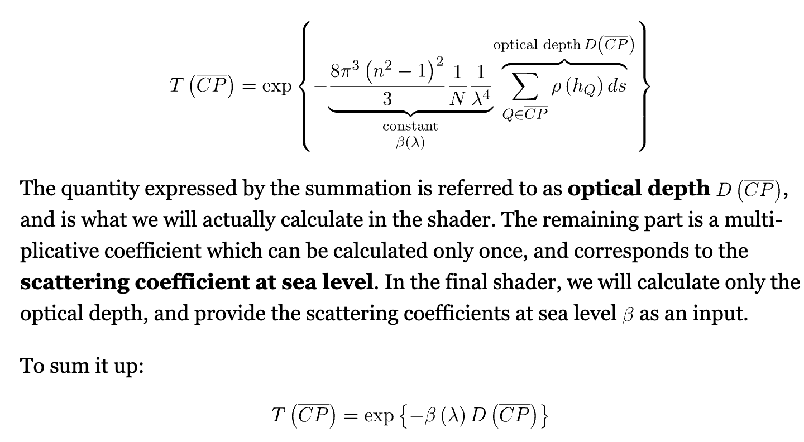
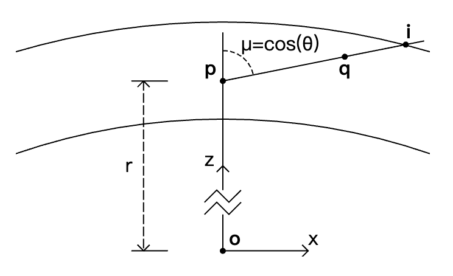
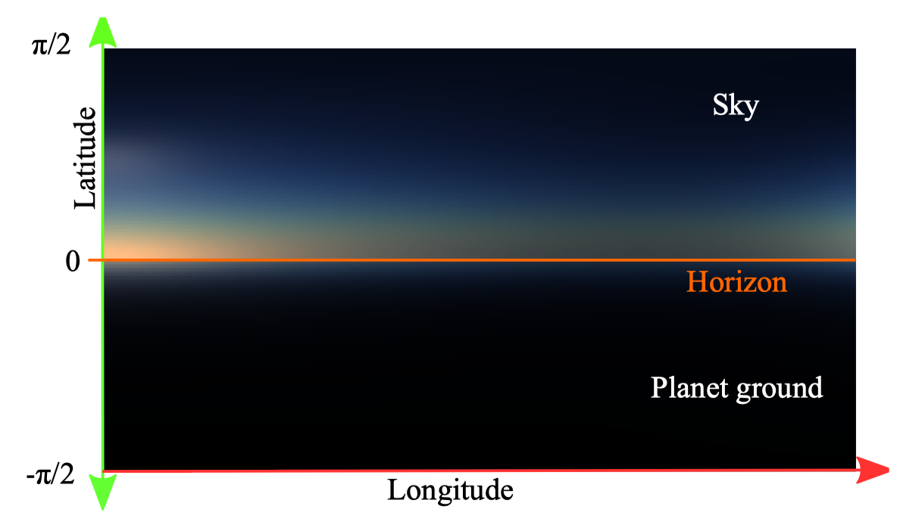
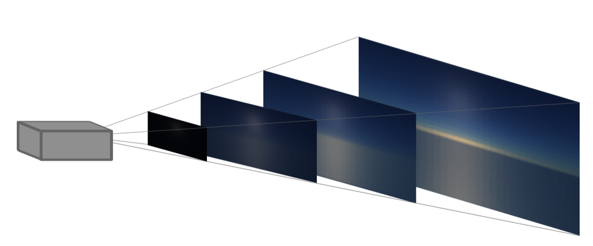
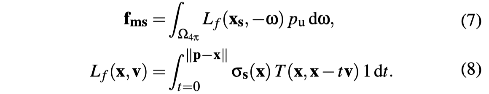
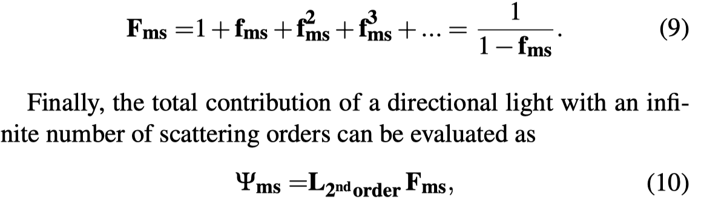
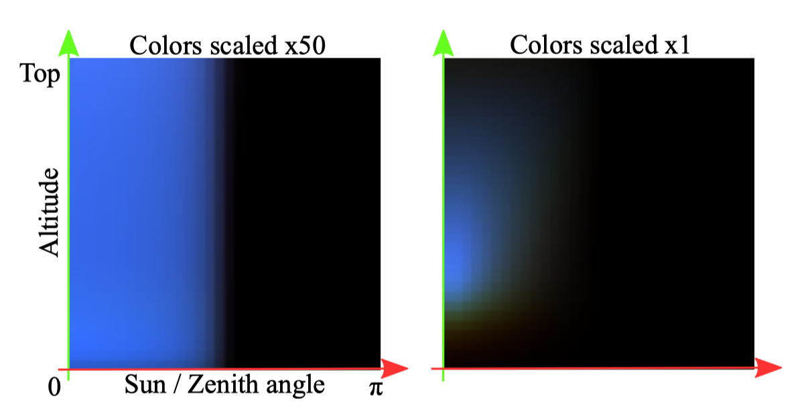
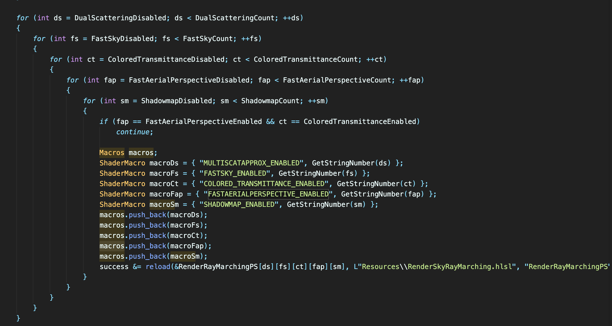

@(CG)

#A Scalable and Production Ready Sky and Atmosphere Rendering Technique

[toc]

## reference

## contributions
- propose a sky and aerial perspective rendering technique re-lying on LUTs to evaluate expensive parts of the lighting integralat lower resolution while maintaining important visual features.
- propose a novel way to evaluate the contribution of light mul-tiple scattering in the atmosphere. It can approximate an infinitenumber of scattering orders and can also be used to acceleratepath tracing.
- supportsdynamic time of dayalong with dynamicupdates of the atmospheric properties, all while rendering efficiently on a wide range of devices, from a low-end Apple iPhone6s to consoles and high-end gaming PCs

## artifacts
- when using very high scattering coefficients, the hue can be lost or even start to drift as compared to the ground truth.
- we assume that the light scattering direction is isotropic right after the second bounce. This is in fact an approximation, which is confirmed by a comparison between our model and the reference path tracer. For Mie scattering only, with g = 0.0 and g = 0.8, RMSE is 0.0058 and 0.039, respectively.


## leave over
- 之前的LUT的一个问题就是，有volumetric shadowing due to hills and mountains的时候会有些artifacts.
epipolar lines [Yus13], shadow volumes [Bru17b], or a variant of shadow volumes extruding meshes from shadow maps [Hoo16]
- 云和大气包括体积雾都是涉及到volume rendering
-  ozone 的 density 高度分布也是有特定的分布的，这个需要再看下

## transmittance LUT
### transmittance


注意$\beta$的定义， represent the ratio of light that is lost by  interactions with a particle.


### LUT
任何一点以任一角度到大气边界的transmittance，可以最终转换成以r, $cos(\theta)$为变量的函数表示

```cpp
Length ComputeOpticalLengthToTopAtmosphereBoundary(
    IN(AtmosphereParameters) atmosphere, IN(DensityProfile) profile,
    Length r, Number mu) {
  assert(r >= atmosphere.bottom_radius && r <= atmosphere.top_radius);
  assert(mu >= -1.0 && mu <= 1.0);
  // Number of intervals for the numerical integration.
  const int SAMPLE_COUNT = 500;
  // The integration step, i.e. the length of each integration interval.
  Length dx =
      DistanceToTopAtmosphereBoundary(atmosphere, r, mu) / Number(SAMPLE_COUNT);
  // Integration loop.
  Length result = 0.0 * m;
  for (int i = 0; i <= SAMPLE_COUNT; ++i) {
    Length d_i = Number(i) * dx;
    // Distance between the current sample point and the planet center.
    Length r_i = sqrt(d_i * d_i + 2.0 * r * mu * d_i + r * r);
    // Number density at the current sample point (divided by the number density
    // at the bottom of the atmosphere, yielding a dimensionless number).
    Number y_i = GetProfileDensity(profile, r_i - atmosphere.bottom_radius);
    // Sample weight (from the trapezoidal rule).
    Number weight_i = i == 0 || i == SAMPLE_COUNT ? 0.5 : 1.0;
    result += y_i * weight_i * dx;
  }
  return result;
}

DimensionlessSpectrum ComputeTransmittanceToTopAtmosphereBoundary(
    IN(AtmosphereParameters) atmosphere, Length r, Number mu) {
  assert(r >= atmosphere.bottom_radius && r <= atmosphere.top_radius);
  assert(mu >= -1.0 && mu <= 1.0);
  return exp(-(
      atmosphere.rayleigh_scattering *
          ComputeOpticalLengthToTopAtmosphereBoundary(
              atmosphere, atmosphere.rayleigh_density, r, mu) +
      atmosphere.mie_extinction *
          ComputeOpticalLengthToTopAtmosphereBoundary(
              atmosphere, atmosphere.mie_density, r, mu) +
      atmosphere.absorption_extinction *
          ComputeOpticalLengthToTopAtmosphereBoundary(
              atmosphere, atmosphere.absorption_density, r, mu)));
}
```
从camera到任意距离的transmittance, 除法关系
```cpp
DimensionlessSpectrum GetTransmittance(
    IN(AtmosphereParameters) atmosphere,
    IN(TransmittanceTexture) transmittance_texture,
    Length r, Number mu, Length d, bool ray_r_mu_intersects_ground) {
  assert(r >= atmosphere.bottom_radius && r <= atmosphere.top_radius);
  assert(mu >= -1.0 && mu <= 1.0);
  assert(d >= 0.0 * m);

  Length r_d = ClampRadius(atmosphere, sqrt(d * d + 2.0 * r * mu * d + r * r));
  Number mu_d = ClampCosine((r * mu + d) / r_d);

  if (ray_r_mu_intersects_ground) {
    return min(
        GetTransmittanceToTopAtmosphereBoundary(
            atmosphere, transmittance_texture, r_d, -mu_d) /
        GetTransmittanceToTopAtmosphereBoundary(
            atmosphere, transmittance_texture, r, -mu),
        DimensionlessSpectrum(1.0));
  } else {
    return min(
        GetTransmittanceToTopAtmosphereBoundary(
            atmosphere, transmittance_texture, r, mu) /
        GetTransmittanceToTopAtmosphereBoundary(
            atmosphere, transmittance_texture, r_d, mu_d),
        DimensionlessSpectrum(1.0));
  }
}
```

## sky-view LUT
resolution: 192 * 108

- u v 含义
其实是建立了以 天顶方向为z轴， 太阳在垂直于天顶方向的平面的向量为x轴的坐标系。
不管观察位置怎么变，根据viewZenithCosAngle和ZenithHorizonAngle进行归一化，始终在sky-view LUT的上半平面或者下半平面采样。
这样到了外太空需要每帧ray-marching计算。
```cpp
void SkyViewLutParamsToUv(AtmosphereParameters Atmosphere, in bool IntersectGround, in float viewZenithCosAngle, in float lightViewCosAngle, in float viewHeight, out float2 uv)
{
	float Vhorizon = sqrt(viewHeight * viewHeight - Atmosphere.BottomRadius * Atmosphere.BottomRadius);
	float CosBeta = Vhorizon / viewHeight;				// GroundToHorizonCos
	float Beta = acos(CosBeta);
	float ZenithHorizonAngle = PI - Beta;

	if (!IntersectGround)
	{
		float coord = acos(viewZenithCosAngle) / ZenithHorizonAngle;
		coord = 1.0 - coord;
#if NONLINEARSKYVIEWLUT
		coord = sqrt(coord); // more samples near horizon
#endif
		coord = 1.0 - coord; // dx uv (0, 0) left top 
		uv.y = coord * 0.5f;
	}
	else
	{
		float coord = (acos(viewZenithCosAngle) - ZenithHorizonAngle) / Beta;
#if NONLINEARSKYVIEWLUT
		coord = sqrt(coord);
#endif
		uv.y = coord * 0.5f + 0.5f;
	}

	{
		float coord = -lightViewCosAngle * 0.5f + 0.5f; // left and right is symmetrical
		coord = sqrt(coord);
		uv.x = coord;
	}

	// Constrain uvs to valid sub texel range (avoid zenith derivative issue making LUT usage visible)
	uv = float2(fromUnitToSubUvs(uv.x, 192.0f), fromUnitToSubUvs(uv.y, 108.0f));
}
```
## aerial-perspective LUT
- 3d texture
  resolution 32  * 32 * 32,   32depth = 32 km
- In-scattering is stored in the RGB channels while the transmittance is stored in the A channel, as the mean of the wavelength dependent RGB transmittance.
- 绘制LUT的时候，camera的位置为(0, 0, 0),  感觉之后即使位置变了，也是根据这个粗略算的（FASTAERIALPERSPECTIVE_ENABLED）。或者就是每帧都重新算。


## multi-scattering LUT
- 含义
   应该希望得到视线方向的积分路径上任意某一点的高阶散射luminance,  在该点会进行最后一次散射(散射后光的传播方向会变成视线方向的反方向)。
- 2d texture
   resolution 32 * 32
- u v 含义
u是阳光反方向的天顶角cos值，v值是离地球半径高度的归一化值。
- assumptions
  - 2阶及2阶以上的multi-scattering在计算时假设是各向同性的，相位函数是一个常量(1 / 4pi)
  - 计算大于2阶的散射时，所有路径上点收到的2阶散射光illuminance是相等的
  - 忽略可见性



```cpp
float3 GetMultipleScattering(AtmosphereParameters Atmosphere, float3 scattering, float3 extinction, float3 worlPos, float viewZenithCosAngle)
{
	float2 uv = saturate(float2(viewZenithCosAngle*0.5f + 0.5f, (length(worlPos) - Atmosphere.BottomRadius) / (Atmosphere.TopRadius - Atmosphere.BottomRadius)));
	uv = float2(fromUnitToSubUvs(uv.x, MultiScatteringLUTRes), fromUnitToSubUvs(uv.y, MultiScatteringLUTRes));

	float3 multiScatteredLuminance = MultiScatTexture.SampleLevel(samplerLinearClamp, uv, 0).rgb;
	return multiScatteredLuminance;
}
```
把texture的u和v分成8*8个线程组进行计算。
```cpp
	auto DispatchCS = [&](UINT w, UINT h)
	{
		uint32 DispatchSizeX = w;// divRoundUp(w, 8); 
		uint32 DispatchSizeY = h;// divRoundUp(h, 8);
		uint32 DispatchSizeZ = 1;
		context->Dispatch(DispatchSizeX, DispatchSizeY, DispatchSizeZ);
	};
```
这里是对某一个高度和太阳天顶角，用compute shader把积分的方向4pi分成了64个采样方向进行求和。
各个方向的2阶散射illuminance存在MultiScatAs1SharedMem.
```cpp
numthreads(1, 1, 64)]
void NewMultiScattCS(uint3 ThreadId : SV_DispatchThreadID)
{
	float2 pixPos = float2(ThreadId.xy) + 0.5f;
	float2 uv = pixPos / MultiScatteringLUTRes;


	uv = float2(fromSubUvsToUnit(uv.x, MultiScatteringLUTRes), fromSubUvsToUnit(uv.y, MultiScatteringLUTRes));

	AtmosphereParameters Atmosphere = GetAtmosphereParameters();

	float cosSunZenithAngle = uv.x * 2.0 - 1.0;
	float3 sunDir = float3(0.0, sqrt(saturate(1.0 - cosSunZenithAngle * cosSunZenithAngle)), cosSunZenithAngle);
	// We adjust again viewHeight according to PLANET_RADIUS_OFFSET to be in a valid range.
	float viewHeight = Atmosphere.BottomRadius + saturate(uv.y + PLANET_RADIUS_OFFSET) * (Atmosphere.TopRadius - Atmosphere.BottomRadius - PLANET_RADIUS_OFFSET);

	float3 WorldPos = float3(0.0f, 0.0f, viewHeight);
	float3 WorldDir = float3(0.0f, 0.0f, 1.0f);


	const bool ground = true;
	const float SampleCountIni = 20;// a minimum set of step is required for accuracy unfortunately
	const float DepthBufferValue = -1.0;
	const bool VariableSampleCount = false;
	const bool MieRayPhase = false;

	const float SphereSolidAngle = 4.0 * PI;
	const float IsotropicPhase = 1.0 / SphereSolidAngle;

    // 八进制来组合theta和phi的index，一位用来做theta的index，一位用来做phi的index
	// Reference. Since there are many sample, it requires MULTI_SCATTERING_POWER_SERIE to be true for accuracy and to avoid divergences (see declaration for explanations)
#define SQRTSAMPLECOUNT 8
	const float sqrtSample = float(SQRTSAMPLECOUNT);
	float i = 0.5f + float(ThreadId.z / SQRTSAMPLECOUNT); // 加上0.5/8的角度偏移
	float j = 0.5f + float(ThreadId.z - float((ThreadId.z / SQRTSAMPLECOUNT)*SQRTSAMPLECOUNT));
	{
		float randA = i / sqrtSample;
		float randB = j / sqrtSample;
		float theta = 2.0f * PI * randA;
		float phi = PI * randB;
		float cosPhi = cos(phi);
		float sinPhi = sin(phi);
		float cosTheta = cos(theta);
		float sinTheta = sin(theta);
		WorldDir.x = cosTheta * sinPhi;
		WorldDir.y = sinTheta * sinPhi;
		WorldDir.z = cosPhi;
		SingleScatteringResult result = IntegrateScatteredLuminance(pixPos, WorldPos, WorldDir, sunDir, Atmosphere, ground, SampleCountIni, DepthBufferValue, VariableSampleCount, MieRayPhase);

		MultiScatAs1SharedMem[ThreadId.z] = result.MultiScatAs1 * SphereSolidAngle / (sqrtSample * sqrtSample);
		LSharedMem[ThreadId.z] = result.L * SphereSolidAngle / (sqrtSample * sqrtSample);
	}
#undef SQRTSAMPLECOUNT

// 这里是在把这些值通过二分法累加到第0个元素上
	GroupMemoryBarrierWithGroupSync();

	// 64 to 32
	if (ThreadId.z < 32)
	{
		MultiScatAs1SharedMem[ThreadId.z] += MultiScatAs1SharedMem[ThreadId.z + 32];
		LSharedMem[ThreadId.z] += LSharedMem[ThreadId.z + 32];
	}
	GroupMemoryBarrierWithGroupSync();

	// 32 to 16
	if (ThreadId.z < 16)
	{
		MultiScatAs1SharedMem[ThreadId.z] += MultiScatAs1SharedMem[ThreadId.z + 16];
		LSharedMem[ThreadId.z] += LSharedMem[ThreadId.z + 16];
	}
	GroupMemoryBarrierWithGroupSync();

	// 16 to 8 (16 is thread group min hardware size with intel, no sync required from there)
	if (ThreadId.z < 8)
	{
		MultiScatAs1SharedMem[ThreadId.z] += MultiScatAs1SharedMem[ThreadId.z + 8];
		LSharedMem[ThreadId.z] += LSharedMem[ThreadId.z + 8];
	}
	GroupMemoryBarrierWithGroupSync();
	if (ThreadId.z < 4)
	{
		MultiScatAs1SharedMem[ThreadId.z] += MultiScatAs1SharedMem[ThreadId.z + 4];
		LSharedMem[ThreadId.z] += LSharedMem[ThreadId.z + 4];
	}
	GroupMemoryBarrierWithGroupSync();
	if (ThreadId.z < 2)
	{
		MultiScatAs1SharedMem[ThreadId.z] += MultiScatAs1SharedMem[ThreadId.z + 2];
		LSharedMem[ThreadId.z] += LSharedMem[ThreadId.z + 2];
	}
	GroupMemoryBarrierWithGroupSync();
	if (ThreadId.z < 1)
	{
		MultiScatAs1SharedMem[ThreadId.z] += MultiScatAs1SharedMem[ThreadId.z + 1];
		LSharedMem[ThreadId.z] += LSharedMem[ThreadId.z + 1];
	}
	GroupMemoryBarrierWithGroupSync();
	// 只有计算到第0个值，即累加已经完成了，才会去更新到texture里
	if (ThreadId.z > 0)
		return;

	float3 MultiScatAs1			= MultiScatAs1SharedMem[0] * IsotropicPhase;	// Equation 7 f_ms
	float3 InScatteredLuminance	= LSharedMem[0] * IsotropicPhase;				// Equation 5 L_2ndOrder

	// MultiScatAs1 represents the amount of luminance scattered as if the integral of scattered luminance over the sphere would be 1.
	//  - 1st order of scattering: one can ray-march a straight path as usual over the sphere. That is InScatteredLuminance.
	//  - 2nd order of scattering: the inscattered luminance is InScatteredLuminance at each of samples of fist order integration. Assuming a uniform phase function that is represented by MultiScatAs1,
	//  - 3nd order of scattering: the inscattered luminance is (InScatteredLuminance * MultiScatAs1 * MultiScatAs1)
	//  - etc.
#if	MULTI_SCATTERING_POWER_SERIE==0
	float3 MultiScatAs1SQR = MultiScatAs1 * MultiScatAs1;
	float3 L = InScatteredLuminance * (1.0 + MultiScatAs1 + MultiScatAs1SQR + MultiScatAs1 * MultiScatAs1SQR + MultiScatAs1SQR * MultiScatAs1SQR);
#else
	// For a serie, sum_{n=0}^{n=+inf} = 1 + r + r^2 + r^3 + ... + r^n = 1 / (1.0 - r), see https://en.wikipedia.org/wiki/Geometric_series 
	// 这里用了论文里拖到的简化公式来计算的
	const float3 r = MultiScatAs1;
	const float3 SumOfAllMultiScatteringEventsContribution = 1.0f / (1.0 - r);
	float3 L = InScatteredLuminance * SumOfAllMultiScatteringEventsContribution;// Equation 10 Psi_ms
#endif

	OutputTexture[ThreadId.xy] = float4(MultipleScatteringFactor * L, 1.0f);
} 
```

## others

这里根据shader的宏的排列组合加载了不同的PS资源。